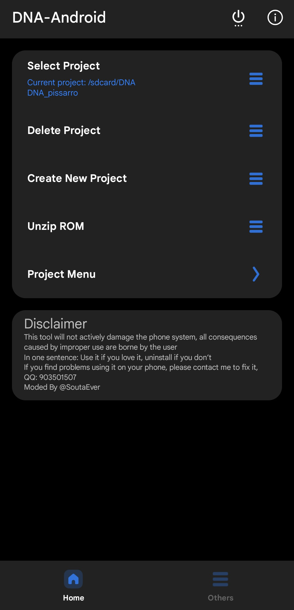
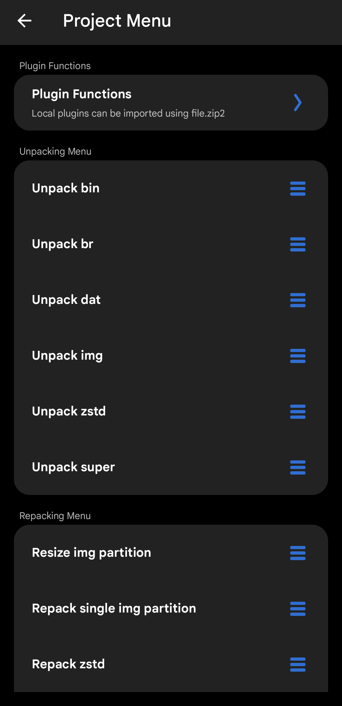
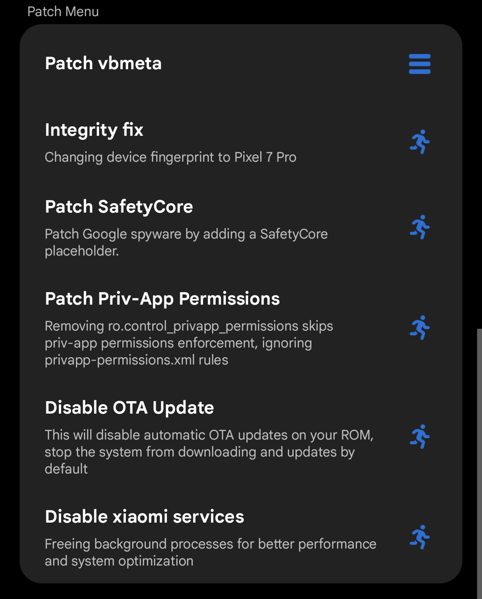
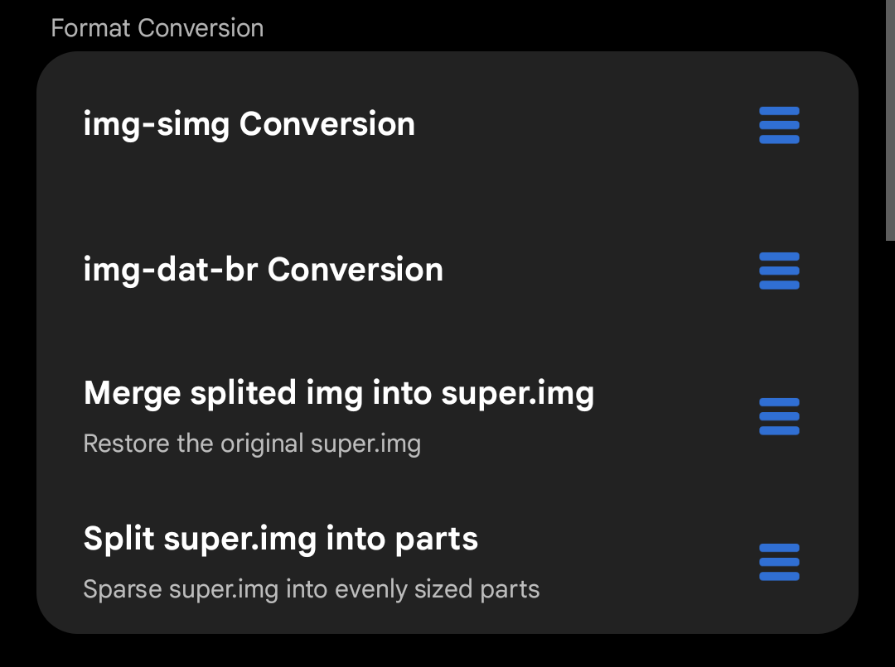
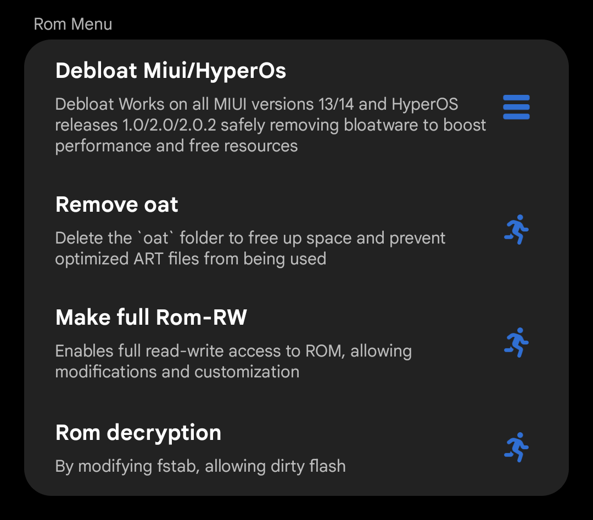
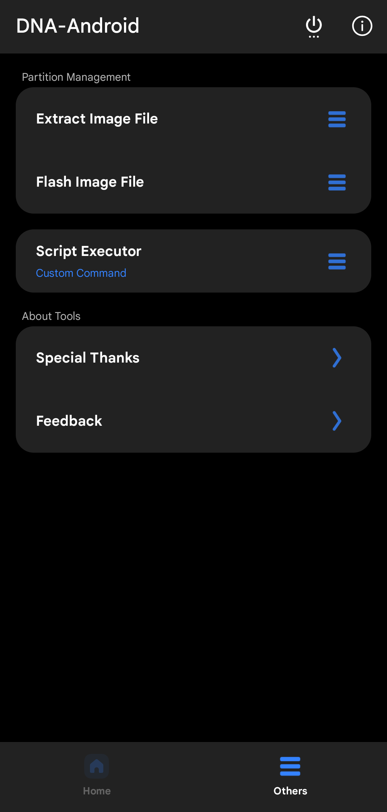

# 🧬 DNA-Android

**A powerful Android ROM toolkit — unpack, repack, patch and modify system images directly on your phone. No PC required.**

---

## 📖 About

**DNA-Android** is a feature-rich, all-in-one Android ROM toolkit that lets you unpack, repack, patch, and modify system partition images — entirely on your Android device, without needing a PC. It is designed for ROM developers, advanced users, and anyone who wants full control over their Android system.

> ⚠️ **Disclaimer:** This tool will not actively damage the phone system. All consequences caused by improper use are borne by the user. Use it if you love it, uninstall if you don't. If you find problems using it on your phone, please open an issue.

---

## ✨ Features

### 📦 Unpacking Menu
Full extraction support for all major Android partition image formats:

| Format | Description |
|--------|-------------|
| `bin` | Unpack binary partition images |
| `br` | Decompress Brotli-compressed `.dat.br` files |
| `dat` | Convert `.dat` → raw image |
| `img` | Unpack `.img` partition images (ext4, erofs, f2fs…) |
| `zstd` | Decompress Zstandard `.zst` images |
| `super` | Unpack `super.img` into individual logical partitions |

### 🔧 Repacking Menu
Rebuild and flash your modified partitions back:

| Action | Description |
|--------|-------------|
| Resize img partition | Resize an ext4 image partition to fit modified content |
| Repack single img partition | Pack a single modified partition back to `.img` |
| Repack zstd | Recompress an image to `.zst` format |
| Repack super.img | Rebuild `super.img` from individual logical partitions |

### 🔄 Format Conversion
Seamlessly convert between image formats:

- **img → simg** — Convert raw image to sparse image format
- **img → dat → br** — Full conversion pipeline for Xiaomi/MIUI-style ROMs
- **Merge split img into super.img** — Restore the original `super.img` from parts
- **Split super.img into parts** — Sparse `super.img` into evenly sized parts for flashing

### 🩹 Patch Menu
Apply system-level patches without touching the source ROM:

| Patch | Description |
|-------|-------------|
| Patch vbmeta | Disable verified boot / AVB to allow custom images |
| Integrity fix | Change device fingerprint to Pixel 7 Pro to pass Play Integrity |
| Patch SafetyCore | Add a SafetyCore placeholder to satisfy Google checks |
| Patch Priv-App Permissions | Skip `privapp-permissions.xml` enforcement |
| Disable OTA Update | Prevent the system from downloading OTA updates automatically |
| Disable Xiaomi services | Remove background Xiaomi processes for better performance |

### ⚙️ Jar Menu (APK/Framework patching)

| Feature | Description |
|---------|-------------|
| Core patch — DSV | Enables direct system app installation by bypassing signature verification |
| Remove APK Protection | Disables built-in APK protection in stock ROMs for seamless app replacement |
| Disable secure screenshot | Removes screenshot/screenrecord restrictions across all apps |

### 📱 ROM Menu

| Action | Description |
|--------|-------------|
| Debloat MIUI / HyperOS | Safely removes bloatware on MIUI 13/14 and HyperOS 1.0 / 2.0 / 2.0.2 |
| Remove OAT | Delete `oat` folder to free space and force ART recompilation |
| Make full ROM-RW | Enable full read-write access to system partitions |
| ROM decryption | Modify `fstab` to allow dirty flash without full wipe |

### 🗂️ Partition Management (Others tab)

- **Extract Image File** — Dump a partition directly from a running device (requires root)
- **Flash Image File** — Flash a modified image directly to a partition on the device
- **Script Executor** — Run custom shell commands / scripts inside the app

### 🔌 Plugin System
DNA-Android supports local plugin imports via `.zip2` files, allowing the community to extend functionality without rebuilding the app.

---

## 📸 Screenshots

| Home | Project Menu | Patch Menu |
|------|-------------|------------|
|  |  |  |

| Format Conversion | ROM Menu | Others |
|------------------|----------|--------|
|  |  |  |  |

---

## 📋 Requirements

- Android **8.0+** (Oreo or higher)
- **Root access** (Magisk / KernelSU / APatch) — required for partition extraction, flashing, and most ROM operations
- Sufficient free storage for working with large image files

---

## 🚀 Getting Started

1. **Download** the latest APK from [Releases](../../releases/latest)
2. **Install** the APK on your rooted Android device
3. **Grant root permissions** when prompted
4. **Create or select a project** from the Home screen
5. Place your ROM files (`.zip`, `.img`, `.dat.br`, etc.) into the project folder
6. Use **Unzip ROM** to extract the archive, then navigate to **Project Menu** to start working

---

## 📁 Supported File Formats

`.img` · `.dat` · `.dat.br` · `.zst` / `.zstd` · `.bin` · `super.img` · `.simg` · `.zip` (ROM archives)

---

## ⚠️ Warning

Modifying system partitions can **brick your device** if done incorrectly. Always:
- Make a full backup before proceeding
- Know what you're doing before flashing anything
- Test on a secondary device first if possible

**The author and contributors are not responsible for any damage caused by improper use of this tool.**

---

## 🤝 Contributing

Pull requests and plugin contributions are welcome! Please open an issue first to discuss any major changes.

---

## 🙏 Credits

- **@SoutaEver**
- **[magiskboot](https://github.com/topjohnwu/Magisk)**
- **[kr-scripts](https://github.com/helloklf/kr-scripts)**
- **[TIK toolbox](https://gitee.com/yeliqin666/TIK)**
- **[sdat2img and img2sdat](https://github.com/xpirt)**
- **[erofs-extract](https://github.com/sekaiacg/erofs-extract)**
- **[DNA](https://gitee.com/sharpeter/DNA)**
- **Gaoji Assistant**
- **[affggh](https://github.com/affggh/fspatch)**

---

## 📬 Contact & Feedback

Found a bug or have a suggestion? Open an [Issue](../../issues) or use the **Feedback** section inside the app.

---

Made with ❤️ for the Android modding community

